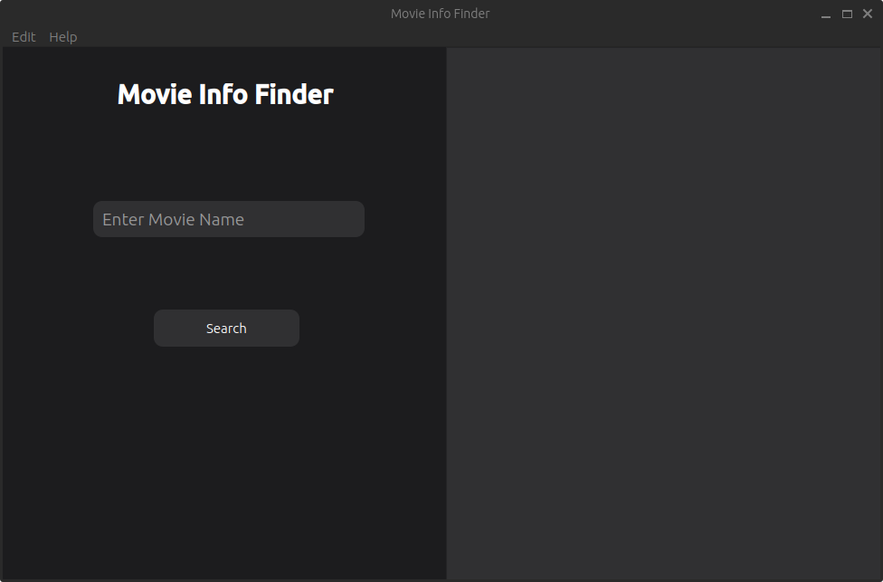
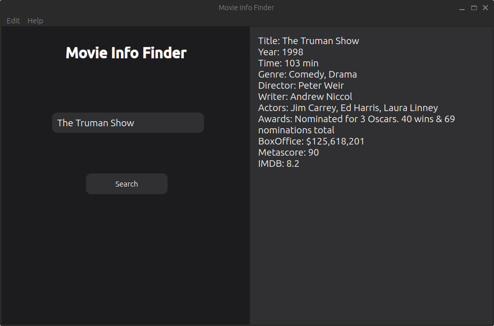

# movie-info-finder-GUI


Movie Info Finder GUI is a Python application built with PyQt6 that allows users to search for movie information using the OMDb API.

## Features

- Search for movies by title
- View detailed information about movies, including title, year, plot, ratings, and more
- User-friendly graphical user interface
- Powered by the OMDb API

## Screenshots




## Requirements

- Python 3.8 or higher
- PyQt6

## Installation

1. Clone the repository:

   ```shell
   git clone https://github.com/danialrashidi0456/movie-info-finder-GUI.git

## Usage

- Enter the movie title in the search bar and click the "Search" button.
- The application will retrieve movie information from the OMDb API and display it in the results area.

